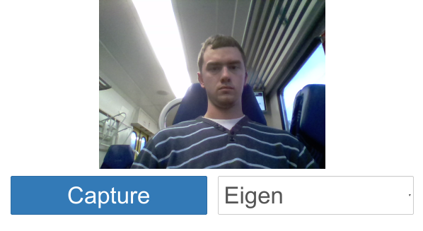
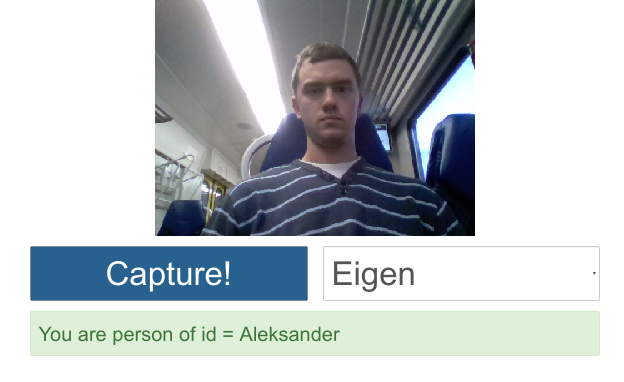
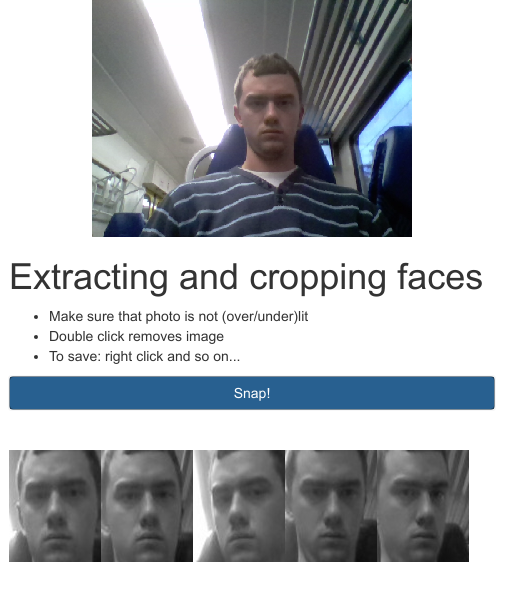

# Face recognition app

This is very typical face recognition app made for Computer Vision course at Silesian University of Technology. 

Backend
* modified recognition examples from OpenCV website in C++, extended with possibilities to pick different methods of recognition
* HTTP API written in Java (Spark) that glues everything together
* Docker is a must, cause we have ugly native dependencies
* "fake" SSL certificate for Chrome to stop complaining

Frontend
* Two pieces, one for recognizing faces, and second for just extracting (useful for collecting training data)
* Decent Webcam.js library for camera support and jQuery+Bootstrap for the rest

